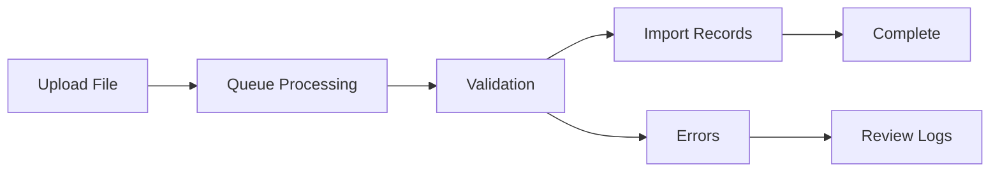

## Overview

The Import/Export API provides endpoints for bulk data operations in MileApp. You can import data sources, tasks, visits, and routes from files, as well as export tasks and configure export templates for recurring exports.

## API Categories

### Data Import

Import data from files into MileApp. Supports multiple import types with background queue processing.

| Endpoint | Description |
|----------|-------------|
| `POST /data/import` | Import data source from file |
| `GET /import-monitoring` | List import monitoring records |
| `GET /import-monitoring/{id}` | Get import monitoring by ID |

<CardGroup cols={2}>
  <Card title="Import Data" icon="file-import" href="/api-reference/importexport/post-dataimport">
    Import data from CSV or Excel files
  </Card>
  <Card title="Monitor Import" icon="chart-line" href="/api-reference/importexport/get-import-monitoring">
    Track import job progress and status
  </Card>
</CardGroup>

#### Supported Import Types

| Type | Description |
|------|-------------|
| `datasource` | Import data source records |
| `task` | Import tasks in bulk |
| `visit` | Import visits for route optimization |
| `route` | Import route data |

<Note>
Import operations are processed asynchronously in a background queue. Use the import monitoring endpoints to track progress.
</Note>

### Export Task

Export tasks and data sources to files for reporting and backup purposes.

| Endpoint | Description |
|----------|-------------|
| `POST /data/export` | Export data source to file |
| `POST /tasks/export` | Export tasks to file |
| `GET /tasks/export-log` | Get task export history |

<CardGroup cols={2}>
  <Card title="Export Tasks" icon="file-export" href="/api-reference/importexport/post-tasksexport">
    Export tasks to CSV or Excel
  </Card>
  <Card title="Export Log" icon="clock-rotate-left" href="/api-reference/importexport/get-tasksexport-log">
    View export history and download files
  </Card>
</CardGroup>

### Export Configuration

Create and manage export templates for consistent, repeatable exports.

| Endpoint | Description |
|----------|-------------|
| `GET /export-configs` | List all export configurations |
| `GET /export-config/{exportConfigId}` | Get export config by ID |
| `POST /export-config` | Create new export configuration |
| `PUT /export-config/{exportConfigId}` | Update export configuration |
| `DELETE /export-config/{exportConfigId}` | Delete export configuration |

<CardGroup cols={2}>
  <Card title="List Configs" icon="list" href="/api-reference/importexport/get-export-configs">
    View all export configurations
  </Card>
  <Card title="Create Config" icon="plus" href="/api-reference/importexport/post-export-config">
    Create a new export template
  </Card>
</CardGroup>

## Import/Export Flow

## Export Configuration Features

Export configurations allow you to:

- **Define field mappings** - Map task fields to export columns
- **Set default filters** - Pre-configure which tasks to export
- **Schedule exports** - Automate recurring exports
- **Customize formats** - Choose output format and structure

## File Formats

### Supported Import Formats

| Format | Extension | Notes |
|--------|-----------|-------|
| CSV | `.csv` | Comma-separated values |
| Excel | `.xlsx` | Microsoft Excel format |
| Excel (Legacy) | `.xls` | Legacy Excel format |

### Supported Export Formats

| Format | Extension | Notes |
|--------|-----------|-------|
| CSV | `.csv` | Comma-separated values |
| Excel | `.xlsx` | Microsoft Excel format |

## Common Operations

<CardGroup cols={2}>
  <Card title="Import Data" icon="upload" href="/api-reference/importexport/post-dataimport">
    Upload and import data files
  </Card>
  <Card title="Export Tasks" icon="download" href="/api-reference/importexport/post-tasksexport">
    Export tasks to files
  </Card>
  <Card title="Monitor Jobs" icon="list-check" href="/api-reference/importexport/get-import-monitoring">
    Track import/export progress
  </Card>
  <Card title="Manage Templates" icon="gear" href="/api-reference/importexport/get-export-configs">
    Configure export templates
  </Card>
</CardGroup>

## Permissions

| Operation | Required Permission |
|-----------|-------------------|
| Import Data | `Import Data` |
| Export Tasks | `Export Task` |
| Export Configs | `View Export Config`, `Edit Export Config` |

## Related Resources

- [Task](/api-reference/task/overview) - Manage individual tasks
- [Data](/api-reference/data/overview) - Data source management
- [Flow](/api-reference/flow/overview) - Configure task templates
