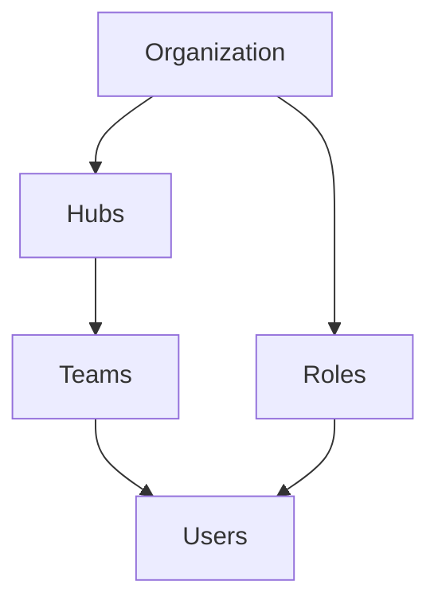

## Overview

The Setting API provides endpoints to manage your organization's configuration, including users, roles, permissions, hubs, teams, and third-party integrations. These settings control access, structure, and behavior of your MileApp organization.

## API Categories

### User Management

Manage users within your organization including creating, updating, inviting, and deactivating users.

| Endpoint | Description |
|----------|-------------|
| `GET /users` | List all users |
| `GET /user/{userId}` | Get user details |
| `POST /user` | Create a new user |
| `PUT /user/{userId}` | Update user information |
| `DELETE /user/{userId}` | Delete a user |
| `POST /user/invite` | Invite a new user |

<CardGroup cols={2}>
  <Card title="List Users" icon="users" href="/api-reference/setting/get-users">
    Retrieve all users in your organization
  </Card>
  <Card title="Invite User" icon="user-plus" href="/api-reference/setting/post-userinvite">
    Invite a new user to join your organization
  </Card>
</CardGroup>

### Role Management

Define and manage roles that control user permissions across your organization.

| Endpoint | Description |
|----------|-------------|
| `GET /roles` | List all roles |
| `GET /role/{roleId}` | Get role details |
| `POST /role` | Create a new role |
| `PUT /role/{roleId}` | Update role permissions |
| `DELETE /role/{roleId}` | Delete a role |

<Note>
Roles define what actions users can perform. Each role has a set of permissions that control access to features and data.
</Note>

### Hub Management

Hubs represent physical locations or warehouses in your organization. They serve as starting points for routes and task assignments.

| Attribute | Description |
|-----------|-------------|
| `_id` | Unique hub identifier |
| `name` | Hub name |
| `address` | Physical address |
| `lat` | Latitude coordinate |
| `lng` | Longitude coordinate |
| `organizationId` | Parent organization |

<CardGroup cols={2}>
  <Card title="List Hubs" icon="warehouse" href="/api-reference/setting/get-hubs">
    Retrieve all hubs in your organization
  </Card>
  <Card title="Create Hub" icon="plus" href="/api-reference/setting/post-hub">
    Create a new hub location
  </Card>
</CardGroup>

### Team Management

Teams allow you to group users within a hub for better organization and task assignment.

| Endpoint | Description |
|----------|-------------|
| `GET /teams` | List all teams |
| `GET /team/{teamId}` | Get team details |
| `POST /team` | Create a new team |
| `PUT /team/{teamId}` | Update team |
| `DELETE /team/{teamId}` | Delete a team |

### App Integration

Manage API integrations and third-party connections for your organization.

| Endpoint | Description |
|----------|-------------|
| `GET /app-integrations` | List all integrations |
| `POST /app-integration` | Create new integration |
| `PUT /app-integration/{id}` | Update integration |
| `DELETE /app-integration/{id}` | Delete integration |

### Plugin Settings

Configure plugins and extensions for your organization.

## Common Operations

<CardGroup cols={2}>
  <Card title="User Management" icon="users" href="/api-reference/setting/get-users">
    Manage organization users
  </Card>
  <Card title="Role Management" icon="shield" href="/api-reference/setting/get-roles">
    Configure roles and permissions
  </Card>
  <Card title="Hub Management" icon="warehouse" href="/api-reference/setting/get-hubs">
    Manage hub locations
  </Card>
  <Card title="Team Management" icon="people-group" href="/api-reference/setting/get-teams">
    Organize users into teams
  </Card>
</CardGroup>

## Organization Hierarchy

## Permissions

Most Setting API endpoints require specific permissions:

| Resource | Required Permission |
|----------|-------------------|
| Users | `View User`, `Edit User` |
| Roles | `View Role`, `Edit Role` |
| Hubs | `View Hub`, `Edit Hub` |
| Teams | `View Team`, `Edit Team` |

## Related Resources

- [Task](/api-reference/task/overview) - Manage tasks within hubs
- [Routing](/api-reference/routing/overview) - Create routes starting from hubs
- [Flow](/api-reference/flow/overview) - Configure task templates
