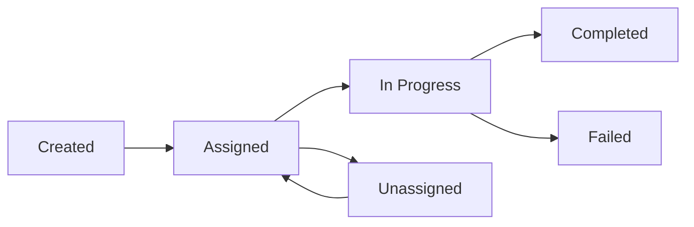

## What is a Task?

A task is an item of work intended for completion by an assignee. It can embody activities like pickups, deliveries, planning, inspections, sales visits, or other work-related actions within your organization. Tasks encompass essential attributes, including IDs, flow, time, status indicators, assignee information, order index, and other pertinent data. The content of a task is configurable based on your specified flow settings. For instance, tasks can serve as visits during the route optimization process, functioning as pivotal elements. The task can also represent a visit in route optimization, please follow [this link](/api-reference/routing/overview) to read more detail.

To see the details of task object, please follow [this link](/api-reference/objects/task-object).

### Task Types

- **Pickups** - Collecting items from a location
- **Deliveries** - Delivering items to a destination
- **Inspections** - Site or equipment inspections
- **Sales visits** - Customer visits for sales activities
- **Planning** - Route planning and optimization
- **Other work-related actions** within your organization

## Task Attributes

Tasks encompass essential attributes including:

| Attribute | Description |
|-----------|-------------|
| `_id` | Unique task identifier |
| `flow` | The flow template used for this task |
| `status` | Current task status |
| `assignee` | User assigned to complete the task |
| `hubId` | Hub where the task belongs |
| `taskTime` | Scheduled time for the task |
| `orderIndex` | Order position for sequencing |
| `attributes` | Custom fields defined by the flow |

<Note>
The content of a task is configurable based on your specified flow settings. Tasks can also serve as visits during the route optimization process.
</Note>

## Task Lifecycle

## Common Operations

<CardGroup cols={2}>
  <Card title="List Tasks" icon="list" href="/api-reference/task/get-tasks">
    Retrieve all tasks with filtering options
  </Card>
  <Card title="Create Task" icon="plus" href="/api-reference/task/post-task">
    Create a new task
  </Card>
  <Card title="Update Task" icon="pen" href="/api-reference/task/put-tasktaskid">
    Update an existing task
  </Card>
  <Card title="Assign Task" icon="user-plus" href="/api-reference/task/put-tasktaskidassign">
    Assign a task to a user
  </Card>
</CardGroup>

## Bulk Operations

MileApp supports bulk operations for efficient task management:

- **Bulk Create** - Create multiple tasks in a single request
- **Bulk Update** - Update multiple tasks at once
- **Bulk Assign** - Assign multiple tasks to users
- **Bulk Move** - Move multiple tasks to different hubs
- **Bulk Delete** - Delete multiple tasks

## Integration with Route Optimization

Tasks can serve as **visits** in the route optimization module. When you create tasks with location data, they can be:

1. Included in route optimization calculations
2. Assigned to vehicles based on constraints
3. Sequenced for optimal delivery routes

For more information about route optimization, see the [Routing](/api-reference/routing/overview) documentation.

## Related Resources

- [Location History](/api-reference/location-history/overview) - Track task execution locations
- [Task Schedule](/api-reference/task-schedule/overview) - Create recurring tasks
- [Flow](/api-reference/flow/overview) - Configure task templates
